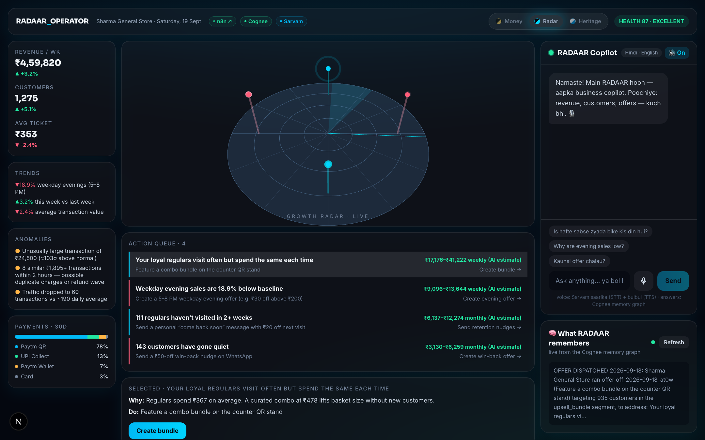
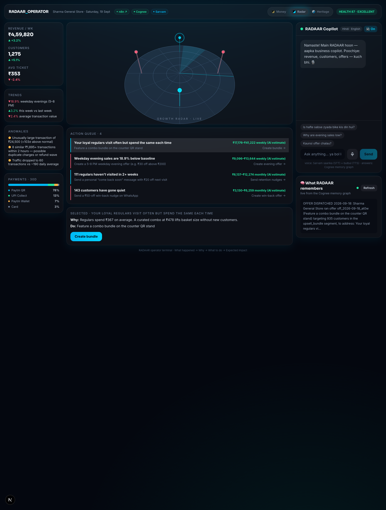
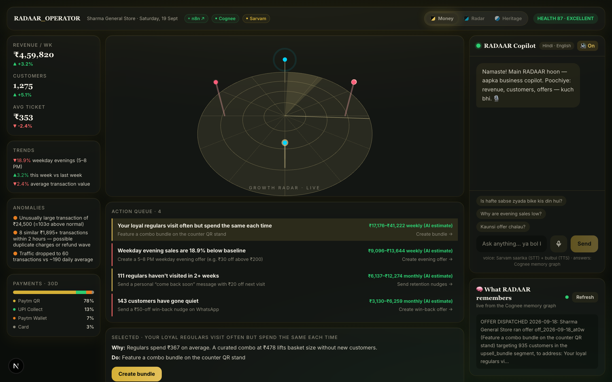

<div align="center">

# 📡 RADAAR

### The AI Growth Radar for Paytm Merchants

**Your business is generating signals. RADAAR tells you what they mean.**

Next.js 15 · Three.js · n8n · Cognee · Sarvam AI · Tailwind CSS



</div>

---

## 🎯 The Problem

India has 3+ crore small merchants — kirana stores, cafes, salons, clinics — who accept digital payments all day long. Every QR scan creates data. And yet:

- They see **numbers, not answers**. A dashboard says revenue changed; it never says *why*.
- They don't know **what to do tomorrow** — which offer to run, which customers are slipping away.
- They can't tell **which opportunity is worth acting on** versus which is noise.
- Analytics tools are built for analysts: charts, filters, jargon. A shopkeeper doesn't read analytics — they need to **see the story**.

**The gap: merchants have data. They don't have answers.**

## 💡 The Solution

RADAAR is an **AI business partner** for every Paytm merchant. It continuously watches transaction data, detects what matters, explains the driver behind it, and recommends the next best action — quantified with expected revenue impact. Instead of dashboards, merchants get a simple visual loop:

> **What happened → Why → What to do → Expected impact**

**The difference in one example:**

| Traditional analytics | RADAAR |
|---|---|
| "Evening sales are down 18.9%." | "Weekday evening sales are 18.9% below **your own** pre-taper baseline because your 5–8 PM regulars (357 customers) are visiting less. **Create a 5–8 PM weekday offer** — est. ₹9.1K–₹13.6K weekly, computed from your data." |

Every impact number is derived from the merchant's own detected patterns — assumptions are labeled as assumptions, benchmarks are never fabricated.

---

## 🖥 The Product — Operator Terminal

The interface is a dense **operator terminal**: everything visible at once, zero scrolling to understand the state of the business.

| Region | What it shows |
|---|---|
| **Status bar** | Merchant, date, business health, and live links to the sponsor platforms (n8n instance, Cognee tenant, Sarvam models) |
| **Left rail** | Revenue / customers / avg-ticket KPIs, every trend, every anomaly, and the Paytm payment mix (QR / UPI / Wallet / Card) |
| **Center** | The **3D growth radar** — rotating sweep, severity-colored blips (cyan = opportunity, amber = watch, red = critical) with pulsing pings, plus the **action queue**: every signal as a row with its ₹ impact and a one-tap CTA |
| **Right rail** | The **voice copilot** (Hindi/English, Sarvam STT + TTS) and **"What RADAAR remembers"** — the actual facts written to the Cognee memory graph |

<div align="center">

</div>

**The money flow, in three taps:**

1. **Create offer** → n8n fires → **Sarvam writes the Hinglish WhatsApp nudge inside the workflow** → the nudge appears in the chat with its offer ID → the dispatch is stored as a fact in Cognee.
2. **Measure outcome** → n8n files the revenue delta → the radar ripples green → the verdict ("+₹28,049, worked") becomes a new memory fact.
3. The next recommendation is now grounded in what actually worked. **The loop learns.**

### Three skins, one terminal

A CSS-variable token system gives the terminal three full themes — switchable live from the header:

<div align="center">

</div>

| Theme | Feel |
|---|---|
| **Radar** (default) | Deep-space command center, cyan sweep |
| **Money** | Private-banking: charcoal + gold, serif numerals |
| **Paytm Heritage** | Light, airy, Paytm-blue daylight — the consumer-app feel |

All text tiers in all themes are **WCAG-AA verified programmatically** (contrast measured in the live DOM, failures fixed).

---

## 🏗 Architecture

```
┌─────────────────────────────────────────────────────────────────────┐
│                            PAYTM / MERCHANT DATA                     │
│         (Paytm APIs / synthetic Paytm-style transaction feed)        │
└──────────────────────────────┬──────────────────────────────────────┘
                               │
┌──────────────────────────────▼──────────────────────────────────────┐
│  1. ORCHESTRATION — n8n (3 live workflows, deployed programmatically)│
│     • Ingest → Detect → Act   • Offer Dispatch   • Outcome → Learn   │
└──────────────────────────────┬──────────────────────────────────────┘
                               │
┌──────────────────────────────▼──────────────────────────────────────┐
│  2. FEATURE LAYER — detection engines (deterministic, testable)      │
│     Trend Detection · Segmentation · Anomaly Detection ·            │
│     Opportunity Scoring (₹ impact, period-normalized)               │
└──────────────────────────────┬──────────────────────────────────────┘
                               │
┌──────────────────────────────▼──────────────────────────────────────┐
│  3. AI LAYER                                                         │
│     Cognee  → merchant memory graph (insight/offer/outcome facts,    │
│               grounded Q&A — answers must trace to stored facts)     │
│     Sarvam  → sarvam-105b chat (in-app + inside n8n),                │
│               saarika STT (mic → text), bulbul TTS (spoken replies)  │
└──────────────────────────────┬──────────────────────────────────────┘
                               │
┌──────────────────────────────▼──────────────────────────────────────┐
│  4. ACTION LAYER — Operator Terminal                                 │
│     one-tap offer creation · WhatsApp nudge (mock delivery) ·        │
│     outcome measurement                                              │
└──────────────────────────────┬──────────────────────────────────────┘
                               │
┌──────────────────────────────▼──────────────────────────────────────┐
│  5. LEARNING LOOP — outcome facts re-enter the Cognee graph;         │
│     every recommendation compounds on measured results               │
└──────────────────────────────────────────────────────────────────────┘
```

### Tech stack & why

| Layer | Tech | Role |
|---|---|---|
| Frontend | **Next.js 15 / React 19**, Tailwind CSS | Operator Terminal, themeable token system |
| Signature visual | **Three.js** | The 3D growth radar: sweep, ring grid with parallax camera, blip pillars, outcome ripple |
| Orchestration | **n8n** | The pipeline *is* n8n — ingest/detect/act, offer dispatch (calls Sarvam), outcome capture. Workflows are deployed and activated **programmatically via the n8n API**; judges can open the instance and watch green executions |
| Merchant memory | **Cognee** | Knowledge graph of every insight, offer and outcome — the copilot's grounded "because" |
| Language AI | **Sarvam AI** | `sarvam-105b` (Hinglish copy + copilot answers), `saarika:v2.5` (speech-to-text), `bulbul:v3` (text-to-speech) |
| Data | TypeScript synthetic generator | 90 days of seeded, realistic Paytm-style transactions: weekday/weekend rhythm, festive spikes, weekday-evening dip, churn cohorts, planted anomalies — **nothing hardcoded, everything computed at runtime** |

### Why this is "Best AI Usage"

- **n8n is load-bearing, not decoration.** Offer creation literally POSTs through the merchant's n8n instance; the workflow calls Sarvam, then writes the dispatch fact to Cognee. The PlatformBar links judges straight to the live executions.
- **Cognee is the memory, visibly.** The "What RADAAR remembers" panel shows the exact facts written to the graph; copilot answers carry a "● grounded in memory graph" badge and fall back to snapshot facts if the graph is unreachable — **never hallucinated**. Verified live: asked "What offers has this merchant run?", Cognee answered with offer IDs, audience sizes, the measured ₹5,750 vs ₹17–41K projected, and the verdict — every number traceable.
- **Sarvam is the voice of the merchant's language.** The mic records → audio is converted client-side to 16 kHz WAV → `saarika` transcribes → the answer is spoken back with `bulbul`. Verified end-to-end in Hindi.
- **Honesty is a feature.** The "synthetic Paytm-style data · nothing hardcoded" chip, computed impact ranges, and labeled assumptions are all deliberate — evaluators can audit every claim.

---

## 🛠 The Process

1. **Understand the merchant** — modeled the deck's questions (Why did revenue change? What tomorrow? Which opportunity matters?) into the 4-step card loop.
2. **Data foundation** — seeded synthetic generator producing 90 days of believable behavior, reproducible for demos.
3. **Intelligence spine** — deterministic engines for trends, segments, anomalies, and ₹-scored opportunities.
4. **The AI loop, live** — 3 n8n workflows deployed programmatically; Sarvam writes nudges inside n8n; Cognee stores and recalls every fact; outcomes close the loop.
5. **Interface** — evaluated **three structurally different designs** (cockpit dashboard, mobile story feed, operator terminal) against sponsor criteria; **Operator Terminal won** and is the product. The evaluation record lives in `PROGRESS.md`.
6. **Polish with evidence** — WCAG-AA contrast verification, real screenshots, theme system, every claim on this README verified against a live run.

## 📈 Business Impact

| Metric | Without RADAAR | With RADAAR |
|---|---|---|
| Time to insight | Never (no interpretation) | Every morning, on one screen |
| Missed revenue | Invisible | Quantified: "₹9.1K–₹13.6K weekly, computed from your data" |
| Customer win-back | Impossible at scale | "143 customers have gone quiet" — one tap |
| Decision quality | Gut feeling | Data-grounded with a cited "because" |
| Learning | Zero — every decision starts from scratch | Compounds — every outcome sharpens the next recommendation |

**For Paytm:** RADAAR converts a payment processor into an **AI business partner** — deepening merchant lock-in, creating a new surface for merchant services (offers, lending signals, inventory), and generating a proprietary *outcome data* asset no competitor has.

**Scale story:** the loop is per-merchant but the engine is shared — the same n8n pipelines and Cognee graph patterns run for a chai stall and a chain, which is what makes "AI business partner for *millions* of merchants" credible.

## 🧪 Market Validation

- **Paytm's own scale:** 3+ crore merchants already transact digitally; merchant payments & services are Paytm's core growth engine. The distribution exists; the intelligence layer is the missing piece.
- **Adoption evidence:** small merchants already act on WhatsApp broadcasts and simple offers when told what to do — the risk lives in *interpretation*, not action. RADAAR removes interpretation.
- **Willingness-to-pay analogues:** merchant SaaS (Khatabook, OkCredit, Posist) proved merchants pay for tools that *do something*, not charts. AI copilots are the fastest-growing merchant-tech category.
- **Deck-grounded demand:** the problem framing ("merchants have data, they don't have answers") mirrors documented SMB pain: a majority of SMB failures trace to cash-flow blindness, not lack of effort.

## 👤 How Users Use It

**Morning ritual (30 seconds):**
1. Open the terminal → health 87/100, radar shows 4 pings, action queue lists every signal with its ₹ impact.
2. The red critical rows float up: *"Weekday evening sales are 18.9% below baseline"* → Why → Do → **₹9,096–₹13,644 weekly (AI estimate)**.
3. Tap **Create evening offer** → the row flips to "running (Sarvam → n8n → Cognee)" → the Hinglish nudge lands in the panel with its offer ID.
4. A week later, **measure outcome** → "+6.1% · +₹28,049 · worked" — and the memory panel shows the new fact.

**During the day:**
5. Ask the copilot by voice in Hindi: *"Is hafte sabse zyada bike kis din hui?"* → spoken answer, grounded in the merchant's own graph (verified live: *"Shanivaar (Saturday) ko hui"*).

**Always:**
6. Switch to the **Money** theme for the morning numbers check, **Heritage** when sharing with the family — same brain, different skin.

---

## 🚀 Run It — Step by Step

### Part A · The 30-second taste (no keys, offline)

```bash
git clone <your-repo-url> radaar && cd radaar
npm install
npm run demo
```

`demo` generates 90 days of synthetic Paytm-style data and prints the whole merchant story: health score, KPIs, trends, anomalies, segments, and every insight card with its computed ₹ impact. Real output:

```
📡 RADAAR — Sharma General Store
Business Health   87/100 (excellent)
Revenue (wk)      ₹4,59,820  (+3.2% vs last week)
Customers         1,275 total · 24 new this week (+5.1%)
Avg Ticket        ₹353 (-2.4%)

▼ weekday evenings (5–8 PM): -18.9% vs pre-taper weekday baseline
• Unusually large transaction of ₹24,500 (≈103σ above normal)
• 8 similar ₹1,895+ transactions within 2 hours — possible refund wave
• Traffic dropped to 60 transactions vs ~190 daily average
```

### Part B · The full product (needs the 3 sponsor keys, ~3 minutes)

**Step 1 — Create your env file:**

```bash
cp .env.example .env
```

Then fill in these five values in `.env`:

| Variable | Where to get it |
|---|---|
| `COGNEE_API_KEY` | https://console.cognee.ai → log in → API keys |
| `COGNEE_BASE_URL` | Same console — your tenant URL (looks like `https://tenant-<id>.aws.cognee.ai`) |
| `COGNEE_TENANT_ID` / `COGNEE_USER_ID` | Same console (identifiers shown with the key) |
| `N8N_BASE_URL` | Your n8n cloud URL, e.g. `https://<you>.app.n8n.cloud` |
| `N8N_API_KEY` | In n8n: **Settings → n8n API → Create an API key** |
| `SARVAM_API_KEY` | https://dashboard.sarvam.ai → API keys |

The `PAYTM_MID` / `PAYTM_MERCHANT_KEY` entries are optional garnish — the demo runs on synthetic Paytm-style data. No OpenAI key needed — Cognee Cloud includes the LLM usage.

**Step 2 — Install dependencies:**

```bash
npm install
```

**Step 3 — Run the full AI loop once** (deploys the 3 workflows to *your* n8n, resets + builds the Cognee memory graph, verifies Sarvam, and proves grounded Q&A end-to-end):

```bash
npm run pipeline
```

Wait for `✅ END-TO-END COMPLETE` (~2 minutes). Open your n8n dashboard afterwards — you'll see **RADAAR · Ingest → Detect → Act**, **RADAAR · Offer Dispatch** and **RADAAR · Outcome → Learning Loop**, all active with green executions.

**Step 4 — Run the app:**

```bash
npm run dev
```

Open **http://localhost:3000**. You're in the Operator Terminal.

**Step 5 — The 60-second click-through:**
1. Watch the radar sweep. Tap any pulsing ping → that signal's row highlights in the action queue.
2. On a critical row, tap **Create …** → wait ~15 s → the Hinglish WhatsApp nudge (written by Sarvam inside n8n) appears with its offer ID.
3. Tap **measure outcome →** → the radar ripples green; the verdict and ₹ uplift appear; the memory panel (right rail) gains a new fact.
4. Click the mic (allow access) and ask in Hindi or English — or tap a suggested question chip. The spoken answer is grounded in the memory graph.
5. Try the theme switcher (header): **Money** for the banking look, **Heritage** for Paytm daylight.

**Step 6 — Show the automation is real (judge moment):**
- Open your **n8n dashboard** → Executions → inspect the node-by-node data of the runs you just triggered.
- The **"What RADAAR remembers"** panel in the app shows the exact facts written to Cognee.
- `/themes` shows all three themes side-by-side.

### Troubleshooting

| Symptom | Fix |
|---|---|
| `booting operator terminal…` forever | Dev server can't reach `/api/snapshot` — check the terminal running `npm run dev` for errors |
| Copilot answers lack the "grounded" badge | Cognee graph not built — run `npm run pipeline` once; the app still answers from the live snapshot (labeled as such) |
| n8n executions missing | Re-run `npm run pipeline` — it deploys and activates the 3 workflows idempotently |
| Mic does nothing | Browser permission denied — typing works everywhere; voice is progressive enhancement |
| `npm run build` fails while dev is running | Stop the dev server first — they share the `.next` directory |

---

## 🗂 Repo Layout

```
├── app/                    # Next.js app router
│   ├── page.tsx            #   Operator Terminal (the product)
│   ├── themes/             #   theme comparison gallery
│   └── api/                #   snapshot · offer · outcome · copilot · stt · tts · memory · platforms
├── components/
│   ├── Radar.tsx           #   Three.js 3D growth radar
│   ├── Copilot.tsx         #   voice copilot (Sarvam STT/TTS, Cognee-grounded)
│   ├── MemoryPanel.tsx     #   "What RADAAR remembers" — live graph facts
│   ├── PaymentMix.tsx      #   Paytm rails breakdown
│   ├── PlatformBar.tsx     #   live sponsor-platform links
│   └── designs/OperatorTerminal.tsx
├── lib/
│   ├── generator.ts        #   seeded synthetic Paytm-style data
│   ├── engines.ts          #   trends · segments · anomalies · health
│   ├── insights.ts         #   opportunity scoring → 4-step cards
│   ├── demo.ts             #   offline spine demo
│   ├── pipeline.ts         #   full AI loop (n8n deploy + Cognee + Sarvam)
│   ├── n8n.ts / n8n-workflows.ts  # programmatic workflow deployment
│   ├── cognee.ts           #   multipart add → cognify → grounded search
│   ├── sarvam.ts           #   chat · STT · TTS clients
│   ├── useRadaarSession.ts #   shared app session (offer/outcome loop)
│   └── wav.ts              #   client-side webm→WAV for Sarvam STT
├── docs/
│   ├── PRODUCT-SPEC.md     # distilled spec from the official deck
│   ├── DEMO-SCRIPT.md      # timed 3-minute live stage script + fallback plan
│   ├── VIDEO-SCRIPT.md     # shot-by-shot script for the submission video
│   ├── JUDGE-PITCH.md      # 30-sec pitch, per-sponsor framing, Q&A crib
│   ├── deck-slides/        # extracted slide images
│   └── screenshots/        # the images in this README
├── PROGRESS.md             # build tracker + design-evaluation record
└── README.md
```

---

<div align="center">

**RADAAR — from payment processor to AI business partner.**
*Every transaction a signal. Every signal an insight. Every insight an opportunity.*

</div>
